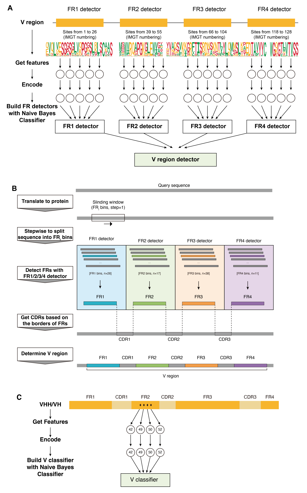

# vtoolkit: Toolkit for the annotation of antibody variable region
Update: January 10, 2023 (Version 1.0)

## Introduction
Vtoolkit determine variable (V) regions from query sequences firstly and then make numbering for V regions according to the IMGT unique numbering.  Based on the hallmarks sites located on FR2 sequence, Vtoolkit destinguish the HCAbs from conventional antibodis automaticlly.


## Functions
- Find V regions, and their subrgions, including FRs and CDRs
- IMGT numbering
- Determine V gene types

## How vtoolkit works
<p align="center">
  
</p>

## Usage
### Get variable region from protein sequences
Use vtoolkit to identify variable regions from query sequences.
```shell
python/main.py \
  examples/refs.faa \
  examples/refs.annotated.csv 
```

### Camel antibody classification: separate heavy chain antibodies from conventional antibodies
```shell
python/main.py \
  examples/camel.faa \
  examples/camel.annotated.csv 
```


## RELEASE NOTES
v1.0, 2013.1.10, original version
